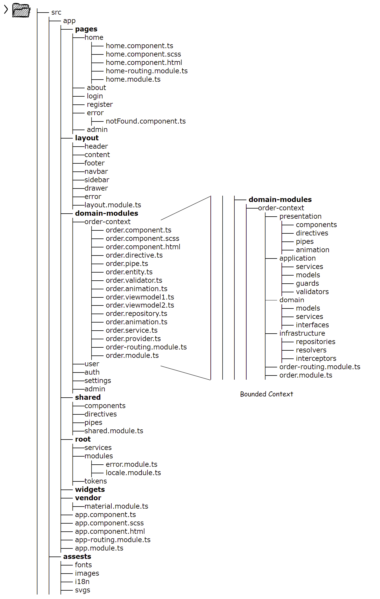
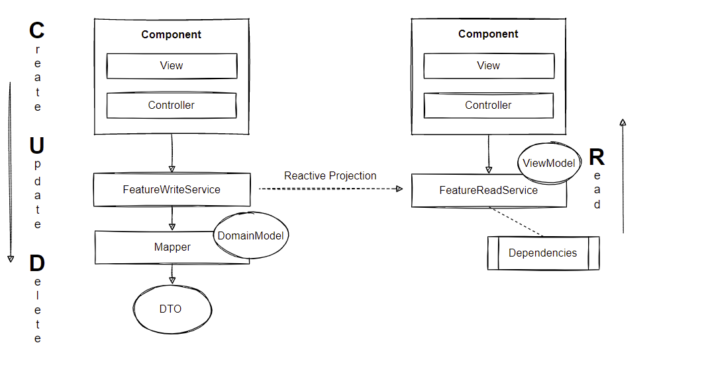
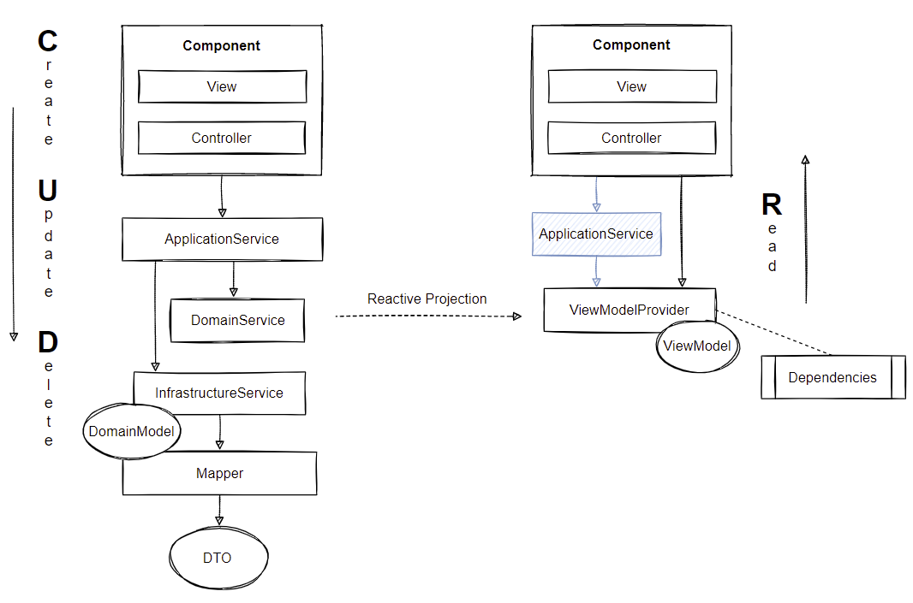
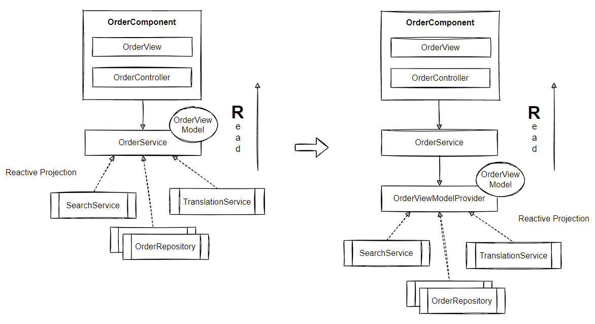
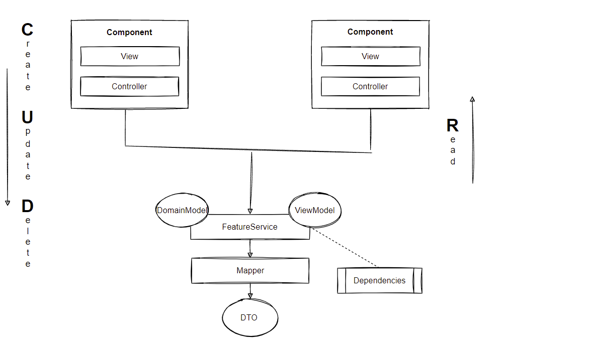

# Introduction (WORK IN PROGRESS)
An introduction for building large-scale enterprise applications with Angular.

# Application architecture 

Applying Object-Oriented Design, Domain-Driven Design and Command-Query-Responsibility-Segregation in the frontend architecture, we break down complex requirements 
into logical boundaries and divide business logic into layers with different responsibilities to keep our code in good condition.

## Frontend coupled to OOD, DDD and CQRS

The building blocks of Angular already provides us with code organisation strategies. Nevertheless, to gain a better design we will bypass the 
traditional data-centric approach and consider strategies like Object-Oriented Design, Domain-Driven Design and Command-Query-Responsibility-Segregation for frontend architectures:


## Object-Oriented Design

Although functional programming has gained a strong foothold in frontend development in recent years, a consistent object-oriented approach
might be better suited for TypeScript projects. Object-Oriented design allows us to approach a more human-readable code base, where the 
ubiquitous language can help to build a better semantic and complex data types. It's important to note, that Angular embraces 
both programming paradigms (Functional- and Object-Oriented Programming).

**» Applying SOLID principles**<br/>

In object orientation the SOLID principles can help to make better design decisions (high cohesion and low coupling). Applying the Dependency
Inversion Principle, we ensure that layers depend on abstraction as opposed to depending on concretion. (Programming to an Interface)

**» Applying cross-cutting concerns**<br/>

The infrastructure layer includes cross-cutting concerns such as logging, caching or security. A naive approach to implement cross-cutting
functionality usually leads to duplicated or coupled code, which violates Don't Repeat Yourself and the Single Responsibility Principle.
The Aspect Oriented Programming promotes an abstraction and encapsulation of cross-cutting concerns by interlacing additional code,
resulting in loose coupling between the actual logic and the infrastructure logic. For more information about AOP in TypeScript please
visit the following website: https://jaxenter.com/cross-cutting-concerns-angular-2-typescript-128925.html

## Layered Architecture

Considering multilayered (4-tier) architectures, the question arises of how to organize layers in SPA applications? This question refers to code splitting,
communication through layers and demanding business logic from services. The multilayered architecture in Domain-Driven Design embraces following layers:

**» Horizontal slicing**<br/> Slicing the application into layers...


**» Vertical slicing**<br/> Slicing the application into features / use cases / bounded context...


**» Cross slicing**<br/> Slicing the application into modules...


*» Abstraction layers*<br/>

- Presentation layer: Components, Widgets, User Interface Services
- Application layer: Use Case Services, View Models and Providers, Factories <br/>
- Domain layer: Aggregates, Entities, Value Objects, Factories, Domain Services <br/>
- Infrastructure layer: Repositories <br/>

*» Service layers* <br/>

- User Interface services carry out dialog or interaction concepts
- Application services carry out business use cases and are procedural 
- Domain services carry out business concepts or processes that don't fit inside entities or value objects
- Infrastructure services help to separate technical concepts from business concepts <br/>

*» Validation layers*<br/>

- Application layer: Data types (null, undefined), format (length, empty, whitespace), schema (email, creditcard)
- Domain layer: Business/Domain Rules, Invariants<br/>

*» Angular adoption*<br/>

- Presentation layer: Views (Templates), Directives, Pipes, Animations
- Application layer: Components, Services, Guards, Validator Functions, Forms, Factories <br/>
- Domain layer: Classes, Interfaces, Factories, Services <br/>
- Infrastructure layer: Resolvers, Interceptors<br/>

Examples:<br/>

Presentation layer: *ModalDialog, Popover, BreakpointObserver, LoadingSpinner*<br/>
Application layer: *Authentication, Search*<br/>
Domain layer: *Domain Logic, Business Logic*<br/>
Infrastructure layer: *Persistence, Caching, Messaging, Crypto, Converter, Validation, Translation*
*Logging, Error, Security, Configuration, Token, Monitoring, Date*

**» Applying Domain-Driven Design to Angular**<br/>

An important aspect of Domain-Driven Design is that the domain model is kept isolated from other concerns of the application. Ideally, the domain layer 
is self-contained and focused on abstracting the business domain. Very often frontend applications validate business rules that are immediately reflected 
in the presentation layer, particularly in SPA applications when navigating through HTML forms that have cross-dependencies in terms of distributed business rules. 
An isolated domain layer allows us to avoid domain logic leaking into other layers. In addition, we don't want to command against the server upon every user input. 
Therefore, the domain layer pattern in the frontend architecture sounds like a very good idea.

Domain-oriented layering is often considered the first structuring criterion in Angular applications. However, layered architecture 
is independent of vertical slicing. It's sufficient to comply with horizontal slicing. The main reasons for modular segmentation in 
Angular applications are lazy-loading, scoping and distribution. 

When application services carry out business or UI use cases, it may be a good idea to keep use cases that contain less logic in the UI controller, 
like in the classic MVC pattern. However, we don't want to hide use cases from the rest of the application and use specialized components instead!
In addition, we want to share state and logic of these specialized components with other independent components. 

It's questionable whether higher granularity distributed across several layers introduce extra complexity in the frontend architecture. 
Should we really comply to Domain-Driven Design in frontend development? As a consequence, many developers tend to lean toward weaker 
patterns because they see it as an unnecessary practice. Often a simpler data-centric approach is sufficient. For most web applications MVC 
or Flux/Redux may be more appropriate. Before starting using advanced concepts we must validate incoming requirements.

# Angular core patterns

Angular's core patterns such as modules, services, factories etc. affords us to comply with domain-driven principles.

## Modules

The angular.io styleguide states categories for organizing blocks of code: **Shared Modules** and **Widget Modules** contain the 
most commonly used code, while **Domain Modules** encapsulate blocks of code, that is not intended to be used outside that module, 
makes **Domain Modules** a good candidate for the bounded context pattern. The **Service Module** shares its content application 
wide as singletons. The **Root Module** includes several domain modules. That is, the entry point is the root module. For a more complete 
overview, visit the following website https://angular.io/guide/module-types#summary-of-ngmodule-categories

Angular's modular system gives a clean design response:  

**» Modular Architecture**<br/>


**» Examples**<br/>

`Service Module`: Application wide services as singletons e.g. *AuthenticationService, LoggerService*<br/>
`Shared Module`: Highly reusable components as non-singletons e.g. *DropDownComponent, PaginatorComponent*<br/>
`Domain Module`: Domain modules such as *OrderModule* (Bounded Context) or *SalesModule* (Bounded Context)<br/>
`Widget Module`: Highly cohesive and reusable widgets e.g. *MatSidenavModule, MatSnackBarModule* <br/>

**» Modules Checklist**<br/>

Following checklist can help to facilitate the orchestration of ngModules:<br/>

- Every component, directive and pipe must belong to **one** and **only one** module
- **Never** re-declare these elements in another module
- **Do not** share contents of a domain module, instead add reusable elements to a shared module
- **Do not** use the providers array of a module to register global services (use provideIn)
- Module content is private by default and only visible to its own content
- Transitive dependencies aren't visible, reexport them to make them available to other modules
- Module content can be exported without being imported

**» Bounded Context Pattern**<br/>

The bounded context pattern in Domain-Driven Design divides the domain model into related domain fragments. In a service-based environment a 
bounded context marks the boundaries of an application service. An application service is a concretion of the bounded context pattern! 
This is similar to **Domain Modules** where we mark the boundaries based on features. Applying the bounded context pattern to domain modules 
allows us to structure modules in a domain-driven approach. A bounded context should consist of at least one aggregate and may consist of 
several aggregates. An important consideration with Angular applications is that the client- or server-side bounded context should integrate 
with REST-based interfaces, as the Angular router engine complies with the navigational behaviour of hypermedia APIs. A bounded context may be 
coupled to the entry point (root URL) like in HATEOAS.: `/BoundedContextA/*API`; `/BoundedContextB/*API`. 
A bounded context can be assigned either to an entire page or to page segments.

Interaction between the bounded context pattern and domain modules:


**» Scaffolding**<br/>

A common practice in Angular projects is to structure the code base into `/core`, `/shared`, `/features` folders. 
Unfortunately, this approach isn't sufficient for a good project layout and is mainly inspired by technical constraints. 
When setting up a folder structure, a domain-driven approach may better suited for complex applications.

Domain-driven scaffolding:



**» Customizing**<br/>

When deciding on a design, customizing the look of default components can quickly become challenging.
Creating frontends that feature modular and reusable CSS without overriding existing CSS rules is an important part of
every frontend project. Usually every component in an Angular project appears in the default style and serves a singular purpose.
Design adjustments for reusable components to specific content areas can be implemented with the `:host()` and `:host-context()` selectors.


Unfortunately the `:host-context()` CSS pseudo-class function lacks browser support. Luckily, Angular supports an emulated version 
through the default settings of the view encapsulation mode.

## Models 

The model in the classic MVC pattern is a representation of application data. The model contains code to create, read, update and delete or 
transform model data. It stores the domain knowledge and is similar to the repository pattern! 

Angular promotes two types of models:

- `View Model`: This object represents data required by a view. It doesn't represent a real world object
- `Domain Model`: This object represents data and logic related to the business domain

The view model and domain model should maintain different data structures to keep the domain model agnostic of view properties

**» Implementation Patterns**<br/>

- Anemic Domain Model
- Rich Domain Model
- View Model 

The anemic domain model is quite often used in CRUD-based web applications as  value container without any behavior of its own, 
conform to RESTful practices. However, it's considered an anti-pattern because it doesn't include business logic and can't protect its invariants. 
Furthermore, it introduces a tight coupling with the client. Using rich domain models instead, we prevent domain logic from leaking into other layers.
The following example shows the negative effects of anemic domain models. 

Domain logic is coupled to the client (UI controller): 

*»  Effects of anemic models* <br/> 
```
class Employee {
    public name: 'John Connor';
    public salary: 1000;
}

@Component({
    selector: 'emp',
    templateUrl: './emp.component.html'
}) class EmployeeComponent {
    @Input() emp: Employee; 
    
    public salaryIncreaseBy(percent: number): void {
         emp.salary = (emp.salary * percent / 100) + emp.salary;
    }
}
```

A rich domain model hides, protects and encapsulates domain logic:

*»  Effects of rich models*<br/>
```
class Employee {
    private name: 'John Connor';
    private salary: 1000;
    public salaryIncreaseBy(percent: number): void{
        if(percent > 100) throw new Error(...);
        this.salary = (salary * percent / 100) + salary;
    }
}

@Component({
    selector: 'emp',
    templateUrl: './emp.component.html'
}) class EmployeeComponent {
    @Input() emp: Employee; 

    public salaryIncreaseBy(percent:number): void {
         emp.salaryIncreaseBy(percent);
    }
}
```

In the second example, domain logic is decoupled from the UI controller. Encapsulation protects the integrity of the model data.
Keeping the model as independent as possible improves reusability and allows easier refactoring.
Neither domain state nor domain logic should be written as part of the UI controller.

Subsequently, using feature services for structural and behavioral modeling while domain models remain pure value containers is another common bad 
practice in Angular projects and known as the "Fat Service, Skinny Model" pattern: 

```
@Injectable()
class AccountService {
    private accounts = [{ id: 1, balance: 4500 }, { id: 2, balance: 2340 }];
    constructor(){}
    public changeBalance(id: number, amount: number): void {
        if (id > 0 && amount < AMOUNT.MAX_VALID) {
            this.accounts[id].balance += amount;
        }
        return this.accounts[id];
    }
    public deposit(){...}
    public widthDraw(){...}
}
```

A better approach would be to place domain logic in entity classes making boundaries become more clear:

```
@Injectable()
class AccountService {
    constructor(private accountRepository: AccountRepositoryService){}  
    public changeBalance(id: number, amount: number): Account {
        const account = this.accountRepository.getById(id);
        account.updateBalance(amount);
        return account;
    }
    public deposit(){}
    public widthDraw(){}
}

class Account {
    private id: number;
    private balance: number;
    constructor(){}
    public updateBalance(amount: number): void {
        if (amount > AMOUNT.MAX_VALID) {
           throw Error(...)
        }
        this.balance += amount;
    }
    public deposit(){}
    public widthDraw(){}
}

@Injectable()
class AccoutRepositoryService {
    private accounts = [new Account(1, 4500), new Account(2, 2340)];
    constructor(){}
    public getById(id: number): Account {
        if (id <= 0) {
            throw Error(...)
        }
        return accounts.find(...)
    }
}
```

In general, using rich domain models means more entities than services. Building rich domain models is a major objective in object-oriented design.

**» Domain Model**<br/>

The domain model entity class contains data and domain-related behavior modeled around business logic.
In terms of DDD and CQRS, the domain model entity class is an aggregate that contains only write operations that result in state changes.

Domain model entity class in the TypeScript syntax (CQS):

```
class Order {
    private quantity;
    private custId;
    private deliveryAddress;
    
    contructor(){}
    
    public placeOrder(){}
    public getOrderItems(){}
    public totalQuantity(){}
    public changeDeliveryAddress(){}
    public getCustomerId(){}
}
```

In traditional object-oriented programming the software model lacked of explicit boundaries. Relationships between classes brought a
complexity that required an efficient design. The aggregate pattern takes a different approach by using clusters of entities and value objects 
that are modeled around invariants and clear boundaries inside the software model making the system easier to reason about.
One of the most important characteristics of the aggregate pattern is to protect it from being invalid and having an inconsistent state.

Aggregate entity checklist:

- An aggregate is a first-class business object
- An aggregate is based on a root entity and acts as a collection of related entities and value objects
- An aggregate has identity, state, lifecycle and receives the name of the bounded context
- An aggregate is modeled around use cases, protecting domain invariants, encapsulation and data integrity
- An aggregate is bounded from the viewpoint of a business use cases
- An aggregate invariants must be satisfied for each state change
- An aggregate validates all incoming actions and ensures that modifications don't contradict business rules
- An aggregate internal state can only be mutated by its own public interface
- Relations between aggregates are managed through ID properties
- Each use case should have only one aggregate, but can use other aggregates to retrieve data
- Multiple aggregates can share one value object

**» Routing and Aggregates**<br/>

Because the navigation mechanism of the Angular router engine complies with the navigational behavior of hypermedia APIs (HATEOAS) where URIs identify resources, conform to RESTful practices, we must reexamine the idea of building 
client-side aggregates. Typically, we declare URIs in the Angular router configuration to enable "deep-linking" the application and UI state. However, as an aggregate builds a cluster of domain-related 
entities and value objects, wouldn't we have to cluster resources instead? With that in mind, the question arises of how to map URIs such as `/orders`, `/customers`, `/addresses` etc. to a client-side 
aggregate, if the resources don't represent a composition already? In the traditional world of database-centric architecture, database tables and their relations were directly identified as resources or as a resource model.
But is this common and always true? Well, it depends on how we define our resources! A resource may be a representation of a single object or a 
composition of several objects that are modeled around business use cases / business processes, database tables or GUI models.

In case resources don't represent aggregates already, the aggregate must be stitched together for each initial routing event and must provide a query API to its internal state. Subsequently, 
an application service provides the public interface to cover all queries to the internal state of an aggregate. In this scenario, the repository services acts 
as an anti-corruption layer to the underlying resource model. 

Unfortunately, this approach doesn't work at all! As the creation process of client-side aggregates may require hundreds of additional HTTP requests (N + 1), the aggregate must be provided by the REST API in the backend!


**» View Model**<br/>

View models are mere data objects and usually don't contain any domain-related behavior. Hence, they are not a part of the domain layer.
View models are supportive in providing data to the view and might extend super view model classes to inherit common properties or behaviour.
They are typically created by merging two or more existing models into one model and are an essential part of every good frontend architecture.

The view model should hold the data necessary to render the UI if:

- View demands a subset of one or more domain model properties
- View demands additional properties mixed up with UI related properties

View model checklist:

- A view model should have an ID property
- A view model should be immutable and has properties of type `readonly string`
- A view model behaves like a value object, also called a data transfer object
- A view model might or might not have dependencies
- A view model should be located in its own file, repository service or UI container component
- A view model name ends with the suffix -View e.g. UserProfileView, UserListView, UserDetailsView

Examples:

```
class OrderViewModel {
    private _orderId: string;
    private _customerId: string;
    private _total: string;
    private _balance: string;
   
    get total(){}
    set total(data) { this._total = this.format(data) }
    get balance(){}
    set balance(data) { this._balance = this.calc(data) }
    
    constructor(){}
    
    private format(){}
    private calc(){}
}

const newOrderViewModel = new OrderViewModel()
newOrderViewModel.total = 444;
newOrderViewModel.balance = -44;
```

Necessary data transformations may reside in the same view model class. A better choice would be to create a dedicated component such as a mapper, translator,
factory or an abstract super class that performs all UI-related transformations. In this way, we can decouple the transformation responsibilities to promote
code reusability by subclassing.

```
abstract class ViewModel {
    constructor(){}
    protected format(){}
    protected calc(){}
}

class OrderViewModel extends ViewModel {
    private _orderId: string;
    private _customerId: string;
    private _total: string;
    private _balance: string;
     
    get total(){}
    set total(data){ this._total = this.format(data) }
    get balance(){}
    set balance(data){ this._balance = this.calc(data) }
    
    constructor(){
      this.super();
    }
}

const newOrderViewModel = new OrderViewModel()
newOrderViewModel.total = 444;
newOrderViewModel.balance = -44;
```

Due to performance implications, it's not recommended embedding `getters` in the view's template. Instead, we will use public properties.

Hardcoding transformation methods in the view model causes tight coupling. A better approach is to process data transformations like filtering, sorting, grouping or destructuring etc.
in reactive streams and hand over the result to an object factory.

**» Object Factory Pattern:**<br/>

Option 1:

```
class OrderFactory {
    public static create() {
      return new Order();
    }
}

const newOrder = OrderFactory.create();
newOrder.propertyA = ...
newOrder.propertyB = ...
```

Option 2:

```
interface OrderProps {
    status: OrderStatus;
}

class Order {
    public status: OrderStatus;
    private constructor(props: OrderProps) {
    	this.status = props.status;
    }
    public static create(props: OrderProps): Order {
      return new Order(props);
    }
    public static empty(): Order {
      return new Order();
    }
    public toJSON(): object {
        const serialized = Object.assign(this);
        delete serialized.status;
        return serialized;
    }
    public toString(): string {
        return "";
    }
}

const newOrder = Order.create({status:OrderStatus.Pending});
const emptyOrder = Order.empty();
```

Option 3:

```
interface IOrder{
    status: OrderStatus;
}

class Order implements IOrder {
    private constructor(public status = OrderStatus.New){}
    public static create(json: IOrder): Order {
        if(!json) return new Order();
        return new Order(json.status);
    }
    public toJSON(): object {
        const serialized = Object.assign(this);
        delete serialized.status;
        return serialized;
    }
    public toString(): string {
        return "";
    }
}

const newOrder = Order.create({status:OrderStatus.Pending});
const jsonOrder = newOrder.toJSON();
```

Option 4:

```
abstract class ViewModel {
  constructor() {}
  protected transformPrice(price: string): string {
    return // Do somthing with price value
  }
}
 
interface IProductViewModel = {
  id: number;
  name: string;
  price: string;
  type: string;
  active: boolean;
};

class ProductViewModel extends ViewModel {
  public id!: number;
  public name!: string;
  public price!: string;
  public type!: string;
  public active!: boolean;

  private constructor(props: IProductViewModel) {
    super();
    this.price = this.transformPrice(props.price); 
    ... // set or transform other properties
  }
  
  private static canNotCreate(props: IProductView): boolean {
    // validate props and return validation result
  }
  
  public static create(props: IProductViewModel): Readonly<ProductViewModel> {
    if (this.canNotCreate(props)) {
        throw Error("Can not create ProductViewModel");
    }
    return new ProductViewModel(props) as Readonly<ProductViewModel>;
  }
}

cosnt productViewModel = ProductViewModel.create({
  id: 1,
  name: 'screw',
  price: '28$',
  type: 'pans',
  active: false
});
```

**» Model Declaration Strategies**<br/>

- Type Signature Pattern

```
type Order = {
     orderId: string;
     status: Orderstatus;
     customer: Customer;
};

// or

interface Order {
     orderId: string;
     status: Orderstatus;
     customer: Customer;
};

const newOrder: Order = {
     orderId = '1';
     status = Orderstatus.Pending;
     customer = {};
}
```

- Object Constructor Pattern

```
class Order {
    public status: OrderStatus;
    public customer: Customer;
    constructor(){}
    public placeOrder(){}
}

const newOrder: Order = new Order();
```

**» Mapper Pattern**<br/>

A domain layer in the frontend architecture ensures that business behavior works. 
With higher functional ability using rich domain models, we must take the mapper pattern into consideration. 
A common practice for preserving type safety is to declare interfaces in support of plain JavaScript object literals. 
In the context of "mapping", it's important to make a clear distinction between the typing system and the data structure of models.

Mapping JSON-encoded server data in the frontend is mandatory if:

- The domain model object defines any methods
- The schema of the Web-API is different from its representation in the application
- The typing system shall consist of classes instead of interfaces or type aliases

The Mapper pattern transfers data between two different schemas:


Let's have a look at how to map the server response schema:

```
read(): Observable<Customer[]> {
    return this.http.get<Customer[]>("/api/customers")
        pipe(
            map((customers: Customer[]) : Customer[] => {
                let result: Customer[] = [];
                customers.forEach((customer:Customer) => {
                    result = [new Customer(customer.firstName, customer.lastName), ...result];
                });
                return result;
            }),
            catchError(()=>{})
        );
};
```

The data mapper pattern is used in the repository service to elaborate the appropriate model schema. 

**» Structural Mapper Pattern**<br/>

A data mapper performs a bidirectional transfer of data structures between two objects:

Option 1 - Classic Assignment:

```
class Order {
    public id; 
    public status; 
    public total;
    constructor(data: Partial<IOrder>) {
       this.id = data.id;
       this.status = data.status;
       this.total = data.total
    }
}

const newOrder = new Order({id=22, status:Status.Pending, total:450})
```

Option 2 - EcmaScript Assignment:

```
class Order {
    public id; 
    public status; 
    public total;
    constructor({ id, status, total = 0 }: Partial<IOrder>) {
        Object.defineProperty(this, 'id', { value: id, writable: false });
        Object.assign(this, { status, total });
    }
}

class Order {
    public id; 
    public status; 
    public total;
    constructor({ id, status, total }: Partial<IOrder>) {
        Object.defineProperties(this, {
            id: { value: id, writable: false },
            status: { value: status },
            total: { value: total },
        });
    }
}

const newOrder = new Order({id=22, status:Status.Pending});
```

Option 3 - Index Signature Assignment:

```
enum Status {
    PENDING = "Pending",
    COMPLETE = "Complete"
}

class Order {
    [key: string]: any;
    constructor(input: { [key: string]: any }) {
        Object.keys(input).forEach((k: string) => {
            this[k] = input[k];
        });
    }
}

const mongo = new Order({ id: 33, status: Status.PENDING })
```

Using an abstract super class to decouple the constructor assignment:

```
enum Status {
    PENDING = "Pending",
    COMPLETE = "Complete"
}

abstract class IOrder {
    [key: string]: any;

    constructor(input: { [key: string]: any }) {
        Object.keys(input).forEach((k: string) => {
            this[k] = input[k];
        });
    }
}

class Order extends IOrder {}

const mongo = new Order({ id: 33, status: Status.PENDING })
```
Unfortunately, index signature assignments don't support access modifier (public, private, protected).

Option 4 - Mapper Assignment:

```
class OrderMapper {
    constructor() {}
    public static mapToOrder(Order, Dto): Order {
        Order.id = Dto.id;
        Order.status = Dto.Status;
        Order.total = Dto.total;
        return Order;
    }
    public static mapFromOrder(Order, Dto): Dto {
        Dto.id = Order.id;
        Dto.status = Order.Status;
        Dto.total = Order.total;
        return Dto;
    }
}

const OrderDto = OrderMapper.mapToOrder(new Order(), Dto);
```

Mapper checklist:

- When using model-driven reactive forms a bidirectional mapping is a must
- We can use the mapper pattern in the repository service to elaborate a pure model
- Don't map to view models in the repository service as view models may require multiple sources

**» REST, HATEOAS & CO.**<br/>

When building multi-layered, distributed web applications, data transformation is among the major challenges that occur when data traverses 
all layers (data flows up and down the stack). If the domain layer has been replicated to the client-side, we may need to transform the 
server response schema to a complex object graph (domain model): 


For example, HATEOAS forms hyperlinks between external resources to make transitions through the application state by navigating hyperlinks. 
However, mapping hyperlinks to a client-side domain model is not desirable! In addition, consuming REST APIs very often multiple HTTP request 
need to be sent asynchronously to assemble a model for a specific use case in the presentation layer. If the applied HATEOAS implementation pattern
forms hyperlinks in a response schema, it would limit the user interface to incorporate with REST APIs synchronously. 
UX designers usually don't model their interaction, navigation and screen patterns around HATEOAS. Furthermore, the Angular router engine doesn't 
comply well with the URI templates of HATEOAS  implementation patterns. HATEOAS has its advantages as well as disadvantages. Even though the router 
in Angular complies with the navigational behaviour of hypermedia APIs, you should avoid HATEOAS for Angular SPA applications!

## Services

Singleton services are important aspects in Angular applications. Most of the functionality that doesn't belong to UI components typically
resides in the service layer. Later, we will discuss the service layer pattern in the form of application-, domain- and infrastructure services according
to Domain-Driven Design practices. The repository pattern will be used in favor of state management services. 

**» Stateful Services vs. Stateful Repositories**<br/>

Just as mentioned before, it's common for Angular projects to use services for business functionality and state management. 
We typically use stateful services if we need to share data across components or process HTTP requests and responses that perform CRUD operations. 
In order to comply with Domain-Driven Design we will implement reactive repository services in favor of an active data store. 
The repository service acts as a reactive storage place for globally accessible objects that can be used by other independent components. 
Repositories in frontend architectures are not just for entities, but for all objects including anemic domain models or view models.
Repositories also act as an anti-corruption layer allowing us to build models without its structure being influenced by the underlying Web-API interface.
This is useful when piecing together an aggregate based on a fine-grained resource-oriented Web-API. 

Furthermore, we will introduce the CQRS pattern to stem the heavy-lift when building complicated page flows and user interfaces. 
The CQRS pattern enables us to answer different use cases with the respective data model. State changes in the repository will immediately
replicate back to the view model (read side), that is, reactive projection through observables. Projections can be leveraged in several ways or layers. 
The most common approach is an event-based projection causing an eventually consistent system. However, we will not encounter any problems of this kind,
due to the reactive design of RxJS (Angular).

A reactive API exposes hot observables (BehaviorSubjects etc.) to manage the complexity of asynchronous data handling. If we share data with 
other components, we must keep track of changes to prevent stale data and keep the UI in sync. RxJS gives us many great tools and 
operators to implement the "projection phase" between the read and write side. 

**» CQRS in the Frontend?**<br/>

With traditional CRUD-based web applications conform to the REST architectural style and the single data model approach,
we may fall into the situation where we have to stitch together several resources to build a rich (view) model.
Even in the case of RPC-like Web APIs, it's likely that we will encounter problems of this kind. Developers often use controller methods 
to elaborate (view) models. Which in the end leads to monolithic controllers:


The domain model focuses on business logic rather than presentation needs. Introducing a view model provider services to manage 
complicated page flows and user interfaces allows us to query the appropriate view model for different UI scenarios. The view model provider service is a perfect 
fit to pre-compute filtering and sorting logic (https://angular.io/guide/styleguide#style-04-13). That is, the CQRS pattern supports us in avoiding 
over-bloated all-in-one models. The CQRS pattern may overcomplicate the system design, instead of simplifying it. Use it with care! 

CQRS in the frontend design system has many advantages:

- Separating concerns of each data model
- Unidirectional data flow
- Composing several API endpoints
- Immutable view models complies with the `.onPush` strategy
- sort() and filter() pipes can be detached from templates (https://angular.io/guide/styleguide#do-not-add-filtering-and-sorting-logic-to-pipes)

The view model provider service may appear in different forms. It may appear as a query method in an application service, or as a dedicated class:

**» CQRS with API Segregation (Feature Services)**<br/>



**» CQRS in compliance with DDD**<br/>



Typically, application services provide query methods for retrieving view models of domain state (CQS). However, for 
complicated page flows and user interfaces it would be inefficient to elaborate view models in a query method, 
due to the large number of additional dependencies. Instead, we can use view model provider services to facilitate access to view models 
in a more efficient way. Consequently, the application service may use the view model provider service to retrieve presentation data. 



This might seem more complex than just using a single feature service for business logic and state management. 
The level of abstraction is up to the developer and is dependent on the incoming requirements. 

Using a single feature service or repository service for reads and writes (CQS):



```
@Injectable()
class ProductsService { 

    private productsSelectedIds: number[] = [0,4,9];
    private products: Product[] = [];
    private productsSelected$: Subject<number> = new BehaviorSubject<number>(selectedProducts);
    private products$: Subject<Product[]> = new BehaviorSubject<Product[]>(products);

    private selectedProductListView: Observable<Readonly<ProductView>[]> = combineLatest([
        this.products$,
        this.productsSelected$,
    ]).pipe(
        map(([products, selected]: [Product[], number[]]) => {
            return products.map((item: Product) => {
                return ProductView.create({
                    ...item,
                    active: selected.includes(item.id),
                });
            });
        }),
        shareReplay(1)
    );

    private constructor(): void {
        this.loadProducts();
    }

    private loadProducts(): void {
        return this.http.get<Product[]>('/products').subscribe(products => this.products$.next(products));
    }
    // Read
    public getSelectedProductsListView(): Observable<Readonly<ProductView>[]> {
        return this.selectedProductsListView;
    }
    
    public addSelectedProduct(id:number): void {
        this.productsSelectedIds = [...productsSelectedIds, id];
        this.productsSelected$.next(this.selectedProducts);
    }
    // Create
    public createProduct(): void {
        ...
    }
    // Update
    public updateProduct(): void {
        ...
    }
    // Delete
    public deleteProduct(): void {
        ...
    }
}
```

The single service approach makes it difficult to gather multiple sources and could lead to circular dependencies. 

**» CQRS and the Command Pattern**<br/>

@TODO [text]
@TODO [image]

**» Projection Patterns**<br/>

With the "projection by entity" pattern changes will be reflected almost simultaneously. 


Let's have a look at how to keep models in sync using factory methods:

```
class Order {
    private orderId: number;
    private quantity: number; 

    public getOrderForSalesView(): OrderForSalesView {
        return new OrderForSalesView(this.quantity);
    }

    public getOrderForCatalogView(): OrderForCatalogView {
        return new OrderForCatalogView(this.orderId);
    }
}
```

Elaborating view models of domain entities violates the single responsibility rule! 
Using abstract classes, we can remove the factory methods:

```
abstract class OrderViewModel {
    abstract orderId: number;
    abstract quantity: number;

    public getOrderForSalesView(): OrderForSalesView {
        return new OrderForSalesView(this.quantity);
    }

    public getOrderForCatalogView(): OrderForCatalogView {
        return new OrderForCatalogView(this.orderId);
    }
}

class Order extends OrderViewModel {
    private orderId: number;
    private quantity: number; 
}
``` 

This implementation has some drawbacks either. It only works for a single entity! 
What if a view model requires several sources? We can create a dedicated class in form of a view model provider service. 
The purpose of the view model provider service is to enclose and create view models for specific use cases. 

```
@Injectable()
class OrderViewModelProvider {
   
    constructor(
      private orderRepository: OrderRepositoryService,             
      private productRepository: ProductRepositoryService,                         
      private translateService: TranslationService              
      ){}

    public getOrdersByStatus(status:string): Observable<Array<OrderViewModel>> {
        return this._orderRepository.getAll()
        .pipe(
          groupBy(status),
          filter(status),
          map(()=>{
             return translateService(data);             
          })
          mergeMap(()=>{
             return of([new OrderViewModel(data)...]);             
          })
        )
    }
    
    public getProductsByOrderId(id:number): Observable<Array<ProductViewModel>> {
        return combineLatest([this._orderRepository.getOrders(), this._productRepository.getProducts()])
        .pipe(
          filter(id),
          groupBy(),
          mergeMap([...]) => {
            return of([new ProductViewModel(data)...]);           
          }),
          shareReplay(1)
        )        
    }
    ...
}
``` 

Requesting the view model provider service in the view controller class:

```
@Component({
  selector: 'order',
  template: `...`,
  providers: [OrderViewModelProvider]
})
export class OrderComponent {

  constructor(private orderProvider: OrderViewModelProvider) {
    this.orderProvider.getOrdersByStatus('pending').subscribe(()=>{})
  }
}
``` 

View model objects may also be elaborated with Angular resolver services!

# State Management 

With Single Page Applications (SPA), we get the flexibility and cross-platform functionality of a web application as well as the 
client state management of native applications. Typically, SPA applications have more complex states than traditional server-side 
applications. In Angular applications, stateful services are the first choice to share state beyond the lifetime of components. 

There are an array of different states to deal with:

Domain State | Addressable State (URL) | Draft State | Persisted State | UI State | Session State | Application State |
------------|------------------|-------------|-----------------|--------------|--------------|--------------|
Entity | Sort/Filter/Search | E-Mail, Comments | IndexedDB, Local Storage | Scroll-position| Cookies, Session Storage | Online/Offline|

## Domain state   

**» Enity**<br/>

Create an entity to manage the domain state of an application. The entity encapsulates methods, that need to operate on that data.

```
class Customer {
    private firstName: string;
    private lastName: string;
        
    get firstName(){}
    set firstName(){}
    get lastName(){}
    set lastName(){}
    
    public isLoggedIn(){}
}
``` 

**» Reactive CUD Repository**<br/>

By implementing a CQRS-oriented repository, we share state and communicate domain state changes through reactive operators (RxJS BehaviorSubjects),
along with the operations, transformations, and rules for creating, manipulating and storing domain state, emitting data anytime a business action
occurs.The repository is allowed to perform data queries, but we don't use the repository for reporting! Unlike the Redux pattern where all the 
state got located in a single central store, we undoubtedly must think a bit more complex on how to manage state crossing several layers. 

Let's have a look at how to define a shared reactive CUD repository: 
           
```
@Injectable()
export class DomainModelRepository<T> extends ... {
    private _data : BehaviorSubject<T[]> = new BehaviorSubject<T[]>([]);
    public data$ = this._data.asObservable();
    
    constructor(private httpClient: HttpClient){}
    
    public findById(...): Observable<T> {}
    public create(...): void {}
    public update(...): void {} 
    public delete(...): void {}
}
```

## Router State

Angular's router service allows us to manage domain and UI state. Put simply, the router state determines which components are visible on the screen, and 
it manages navigation through application state (HATEOAS). Any state transition results in a URL change! It's important to note, the router is a 
resource-oriented engine, we **cannot place more than one component into the same location at the same time** (~Auxiliary Routes!). 
This means, if building a router SPA, we should drive with UX-Driven Design to determine the appropriate data models for the Web API interface. 
The UI project should comply with User-Centered Design (UCD), where user actions define the URL workflow.


In Addition to that, we must ensure that routes are provided by the Web API layer. For example, don't use routes 
like /products/:id/edit?filter='mam', if the Web API layer doesn't support query parameters. Always validate if API routes will be available 
through the Web API! 

## UI State

Build a UI service anytime a component needs to stash away some property values or for communication with itself or others (action stream). 
It offers a simple set of properties to share state. This pattern is good for retaining view state or draft state.

```
@Injectable 
export class UIService{
    public showPicture: boolean;
    public filterBy: string; 
}
```

**» Keep the state in sync**<br/>

Angular's change detection provides notification of any changes to state values by `getter` accessor methods, if the values are bound in the template. 
This way, we keep the state in sync. Observables, Subjects or BehaviorSubjects can help to simplify asynchronous data-handling. 
When sharing data that should always be in sync, reactive extensions are good solutions to this situation.
       
## Application-, Domain- and Infrastructure Services

One downside of sharing and binding state through services is that they are coupled to the view. Delayed changes to the state must be managed 
by asynchronous binding techniques to **keep the shared state in sync**. However, with EventEmitters, Subjects or BehaviorSubjects we share data 
through notifications. We subscribe and react to changes using notification services. Those notifications are more than just changes to bound values. 

**» Application Service**<br/>

@TODO [text]
@TODO [image]

**» Domain Service**<br/>

@TODO [text]
@TODO [image]

**» Infrastructure Service**<br/>

Let's have a look at how to build a notification service based on a Subject:

```
@Injectable()
export class NotificationService {
    private _subject = new Subject<any>();
 
    public notify(news: string): void {
        this._subject.next({ news: news });
    }
 
    public listen(): Observable<any> {
        return this._subject.asObservable();
    }

    public complete(): void {
        return this._subject.complete();
    }
}
```

# Component Tree Design

When developing a single page application based on the router module, we should primarily think of the component hierarchy and sketch 
wireframes alongside the component tree. This way, we can easily approach an UX-Driven API design. The top-down flow ensures that the GUI 
storyboard is compatible with the resource representation enforced by RESTful practices. By mapping a GUI storyboard to the component tree 
we are able to identify full business use cases. The following phase model will be used as a basis:

`Information Architecture` &rarr; `Interaction Design` &rarr; `Visual Design` &rarr; `Usability Testing`


Almost conform to REST and HATEOAS, we notice a clear navigation path which makes it considerable to map wireframes to the component tree. 
It is obvious that this approach doesn't comply with a DDD task-based UI projection because the router configuration is tide coupled to HATEOAS.
Moreover, while with task-based UI components we expect appropriate view models, the HATEOAS approach provides us with CRUD-based resource models. 
Very often service providers create RESTful Web APIs, where clients have to stitch data together by themselves. In order to satisfy UX requirements 
it is not feasible to prepare read models for every client's use case! In this context a HATEOAS approach is excellent for mobile devices and CRUD-based applications, 
but can be crucial to smart desktop applications. For more information about REST and data aggregation visit the following website: https://phauer.com/2015/restful-api-design-best-practices/ 

## Navigation Patterns

As layout complexity increases with screen resolution, it requires careful considerations when starting from a mobile-first approach 
and scaling up to desktop layouts. Traditional desktop layouts require more complex interaction and navigation patterns because UX engineers 
normally address usability problems at first place and do not take into account any RESTful practices. As mentioned before, the 
router engine is a resource-oriented engine (HATEOAS) with which we have limited possibilities regarding arbitrary navigation patterns. 
The most commonly used navigation patterns are: 


With the master-master and master-details patterns we comply with RESTful resource association and resource aggregation 
with reference to one and only one component. Indeed secondary (Auxiliary) and pathless (Master-Children) routes allows us 
to initiate several components in parallel, but bringing limitations and sacrifices to a special syntax that doesn't comply 
with RESTful practices. 


Pathless or componentless routes are a good way to share data between sibling components. This kind of routes provide a way
to load several components at a time. However, deep-linking is not supported how it should be. It exists a hack to enable 
deep-linking to some extend. This is achieved by checking route params in named router outlets or by intervening with
Resolvers or Route Guards. If specific invariants evaluate to true, we will display the component:

`<router-outlet *ngIf="id==='22'" name='employee'></router-outlet>` 

The pathless strategy is not well documented, especially when it comes to deep-linking it leads to unexpected behavior.
Secondary (Auxiliary) routes should be addressed in any use case that requires a few components to be initiated in 
parallel at random places. The router module is therefore well suited for mobile related navigation patterns. 


# Business Rule Validation & ErrorHandling

@TODO [text]
@TODO [image]

# Summary

With multi-layered applications it is clear that critical decisions have to be made regarding technical aspects at the micro-level. 
Most of them are determined by the requirements at the macro-level, which includes decisions on the scope of:

- SPA vs. MPA
- UX vs. Domain-Driven vs. Data-Driven vs. API First
- Smart vs. Dump client
- Public vs. Private Web API
- Mobile vs. Desktop first
- Offline vs. Online first
- Functional vs. Object-Oriented Design
