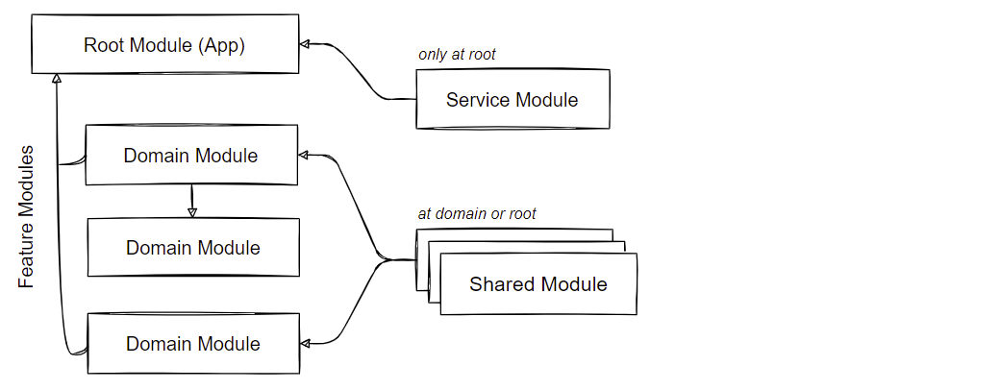

# Introduction (WORK IN PROGRESS) 
An introduction to build enterprise web applications with Angular.

# Application architecture 

Angular embraces principles and patterns of Domain-Driven Design. Applying Domain-Driven Design and Command-Query-Responsibility-Segregation in the frontend design system, we break down complex requirements into logical boundaries and divide business logic into layers with different responsibilities to keep our code in good condition.

## Frontend coupled to DDD, OOD and CQRS

The building blocks of Angular already provides us with code organisation strategies. Nevertheless, to gain a better design we will bypass the traditional data-driven approach and consider strategies like Domain-Driven Design and Command-Query-Responsibility-Segregation:


Considering multilayered architectures, the question arises of how to organize layers in SPA applications? This question refers to code splitting, communication across layers and demanding business logic through services.

## Layered architecture

The multilayered architecture consists of the following layers:

**» Horizontal cut**<br/> Cutting the application into layers...


**» Vertical cut**<br/> Cutting the application into features / use cases...


**» Cross cut**<br/> Cutting the application into modules...


*» Abstraction layers*<br/>

- Presentation layer: GUI Components, Widgets
- Application layer: Use Case & UI Services, View models, View model providers <br/>
- Domain layer: Aggregates, Entities, Value objects, Domain model repository interfaces <br/>
- Infrastructure layer: Domain model repository implementations <br/>

*» Service layers* <br/>

- Stateful UI services coordinate UX logic and state that doesn't change the domain state
- Stateful application services carry out business and UI use cases and are procedural 
- Stateless domain services carry out business use cases at a higher level than entities or value objects
- Infrastructure services help to separate technical and business concepts  <br/>

*» Validation layers*<br/>

- Application layer: Data types (null, undefined), format (length, empty, whitespace), schema (email, creditcard)
- Domain layer: Business/Domain Rules, Invariants<br/>

Examples - Application layer: *Authentication, Search*<br/>
Examples - Infrastructure layer: *Repository, Persistence, Caching, Messaging, Crypto, Converter, Validation, Translation*<br/>
Examples - Cross-Cutting layer: *Logging, Error, Tracing, Security, Configuration, Token, Monitoring, Date*

**» Applying DDD to Angular**<br/>

An important aspect of Domain-Driven Design is that the complexity of the domain model is kept isolated from other concerns of the application. Ideally, the domain layer is self-contained and focused on abstracting business rules. Because frontend applications very often evaluate business rules that are reflected in the presentation layer right away - especially in SPA applications when navigating through HTML forms that have cross-dependencies in terms of composite business rules, a domain layer in the frontend sounds like a good idea.

In Angular, domain-oriented layering (vertical cut) is often considered the first structuring criterion. However, layered architecture is a good design methodology even without domain-oriented layering. It's usually sufficient to use a layered model (horizontal cut), which is simply set up using folders. The main reason for modular segmentation in Angular is lazy-loading and distribution. 

When application services carry out business use cases it may be a good idea to place business use cases that contain less logic directly in UI controllers (like in MVC). However, we don't want to hide business use cases from the rest of the application and declare dedicated classes! Additionally, we may want to share state and logic of an application service with other application services. **Application services may encapsulate logic that only take place as a part of the presentation layer such as "ProductCategorySelected" or "ProductSearch", described as action streams.**

Using business services only for structural and behavioral modeling while domain models remain pure value containers that can't protect their invariants is a common bad practice in frontend projects. Hence, building rich domain models is a major objective in object-oriented applications. In general, using rich domain models means more entities than business services. 

It's debatable whether higher granularity distributed across many layers introduce extra complexity in the frontend design system. Do we really need Domain-Driven Design in frontend development? As a consequence, many developers tend to lean toward weaker patterns because they see it as an unnecessary practice. Often a simpler data-driven approach is sufficient enough. For most web applications MVC or Flux/Redux may be more appropriate. Before starting using advanced concepts we must evaluate incoming requirements.

## Object-Oriented Design

Although functional programming has gained a strong foothold in frontend development in recent years, a consistent object-oriented approach is better suited for Angular projects. Object-oriented design allows us to approach a more human-readable code base, where the UL (Ubiquitous language) can help to design a better taxonomy and complex 
data types. It's important to note, Angular embraces both programming paradigms (FP & OOP).

**» Applying SOLID principles**<br/>

In object orientation the SOLID principles can help to make better design decisions (high cohesion and low coupling). Applying the Dependency Inversion Principle, we ensure that layers depend on abstraction as opposed to depending on concretion. => Programming to an Interface!

For example, we provide the domain layer as an abstraction by using interfaces / type aliases.

**» Applying cross-cutting concerns**<br/>

The infrastructure layer includes cross-cutting concerns such as logging, caching or security. A naive approach to implement cross-cutting functionality usually leads to duplicated or coupled code, which violates Don't Repeat Yourself and Single Responsibility Principle. The Aspect Oriented Programming promotes an abstraction and encapsulation of cross-cutting concerns by interlacing additional code, resulting in loose coupling between the actual logic and the infrastructure logic. For more information about AOP in TypeScript please visit the following website: https://jaxenter.com/cross-cutting-concerns-angular-2-typescript-128925.html

# Angular strategies

The Angular design strategies such as modules, services, components etc. encourages us to comply with DDD principles.

## Modules

The Angular styleguide names different categories for organizing blocks of code: **Shared Modules** and **Widget Modules** contain the most commonly used code, while **Domain Modules** encapsulate blocks of code, that is not intended to be used outside that module, makes **Domain Modules** a good candidate for the bounded context pattern. The **Service Module** shares its content application wide as singletons. The **Root Module** includes multiple domain modules. That is, the entry point is the root module. For a more complete overview, visit the following website https://angular.io/guide/module-types#summary-of-ngmodule-categories

 Angular's module system gives a clean design response:  

**» Modular architecture**<br/>



**» Examples**<br/>

`Service Module`: Application wide services as singletons e.g. *AuthenticationService, LoggerService*<br/>
`Shared Module`: Highly reusable components as multitons e.g. *DropDownComponent, PaginatorComponent*<br/>
`Domain Module`: Domain modules such as *OrderModule* (Bounded Context) or *SalesModule* (Bounded Context)<br/>
`Widget Module`: Highly reusable widgets as multitons e.g. *MatSidenavModule, MatSnackBarModule* <br/>

**» Module guidelines**<br/>

Following guidelines can help to facilitate the orchestration of ngModules:<br/>

-	Every component, directive and pipe must belong to **one** and **only one** module
-	**Never** re-declare these elements in another module
-	Except services, module contents are private by default and transitive dependencies aren't visible
-   **Do not** share contents of a domain module, instead add reusable elements to a shared module
-   **Do not** import shared modules into the root module
-   **Do not** import the service module more than once! Use DI lookup hooks to prevent multiple instantiation

**» Bounded context pattern**<br/>

The bounded context pattern in Domain-Driven Design divides the domain model into related domain fragments. In a service-based environment a bounded context marks the boundaries of an application service. An application service is a concretion of the bounded context pattern! This is similar to **Domain Modules** where we mark the boundaries based on features. Applying the bounded context pattern to domain modules allows us to structure modules in a domain-driven context. A bounded context should be presented at minimum scale as an aggregate and may consist of several aggregates. An important aspect in conjunction with SPA applications is that a (client- or server-side) bounded context must provide a REST-based API because the Angular router engine complies with the navigatorial behaviour of hypermedia APIs. A bounded context only coupled to the URI of the entry point resource (root), subsequently it's hypermedia to navigate the state of the application: `/BoundedContextA/*API`; `/BoundedContextB/*API`. 
A bounded context can be assigned either to an entire page or to page segments.

Interaction between the bounded context pattern and Angular domain modules:


**» Project scaffolding**<br/>

Many similarities exist when comparing Domain-Driven Design and Angular. However, there are also some points of friction. For example, the classification of the **Domain Module** is the only artifact that can be attributed directly to Domain-Driven Design. Other modular categories such as the **Routing Module**, **Widget Module** or **Service Module** can't be attributed to Domain-Driven Design, because Domain-Driven Design doesn't focus on the presentation layer / GUI. The **Shared Module** could be the equivalent of the **Shared Kernel** bounded context pattern. 

Another aspect relates to visibility. Angular services very often provided as global instance, which automatically gives them a shared status. Shared singletons and modular encapsulation aren't good to work hand-in-hand.

Domain-driven project scaffolding for Angular applications:


## Models 

The model in the classic MVC pattern is a representation of application data. The model contains code to create, read, update and delete or transform model data. 
It stores the domain knowledge and is very similar to the Repository pattern! The differences between the various patterns come down to an historical 
context of the model: Data Model (MVC), Resource Model (REST), Domain Model (DDD), View Model (UX), Class Model (UML), Entity Model (ERM) and so forth. 
  
Angular promotes two types of models:

- `View Model`: This object represents data required by a view. It does not represent a real world object
- `Domain Model`: This object represents data and logic related to the business domain

The view model and domain model should have different schemas to hold the domain model agnostic of the view.

**» Implementation patterns**<br/>

- Anemic Domain Model
- Rich Domain Model
- View Model 

The anemic domain model is quite often used in CRUD-based web applications as value container, conform to RESTful practices. The anemic domain model, however, is considered an 
anti-pattern because it does not contain business logic except `get` and `set` (CRUD) methods. It introduces a tight coupling with the UI controller and can't protect its invariants. Hence, the rich domain model is a more suitable candidate. By leveraging rich domain model representations we prevent **domain logic spreading across different layers multiple times**. The following example shows the negative side effect when using anemic domain models. 

Domain logic is coded in the UI controller: 

*»  Effects of anemic models* <br/> 
```
@Component({
    selector: 'emp',
    templateUrl: './emp.component.html'
}) class EmployeeComponent {
    @Input() emp: Employee; 

    public salaryIncreaseBy(percent:number){
         emp.salary = (emp.salary * percent / 100) + emp.salary;
    }
}
```

A rich domain model instead hides and encapsulates domain logic:

*»  Effects of rich models*<br/>
```
@Component({
    selector: 'emp',
    templateUrl: './emp.component.html'
}) class EmployeeComponent {
    @Input() emp: Employee; 

    public salaryIncreaseBy(percent:number){
         emp.salaryIncreaseBy(percent);
    }
}
```

In the second example the domain logic is loosely coupled from the UI controller. Encapsulation protects the integrity of the model data.
Keeping the model as independent as possible improves usability and allows easier refactoring.
**Neither domain state nor domain logic should be coded in UI controllers**.

**» Mapper pattern**<br/>

By leveraging rich domain models on the client side, we ensure that business behavior works. With higher functional ability in rich domain models, we must take the Mapper pattern into account. Mapping server data to the domain model and vice versa may be unnecessary if the domain model and server storage schema match. A common practice in TypeScript-based frontends is the use of interfaces or type aliases in conjuction with plain JSON object literals. In the context of mapping, a distinction must be made between the type system and the data schema.

Mapping JSON-encoded server data to the model is mandatory if:

- The domain model object defines any methods
- The schema in the database is different from its representation in the application

The Mapper pattern transfers data between two different schemas:


Let's have a look at how to map the server response schema:

```
read(): Observable<Customer[]> {
    return this.http.get<Customer[]>("/api/customers")
        pipe(
            map((customer: Customer[]) : Customer[] => {
                let result: Customer[] = [];
                customer.forEach((customer) => {
                    result = [new Customer(customer.firstName, customer.lastName), ...result];
                });
                return result;
            }),
            catchError(()=>{})
        );
};
```

The data mapper is used in the repository pattern to elaborate the correct domain model schema. 

**» Translator pattern (Mapping VM to DM and vice versa)**<br/>

@TODO [text]
@TODO [image]

**» REST, HATEOAS and the Mapper pattern**<br/>

When building multi-layered, distributed web applications, data transformation is among the major challenges that occur when data traverses 
all layers (data flows up and down the stack). Hence, if the domain model resides on the client side, we must transform the server 
response schema to a complex object graph: 


For example, HAL is a hypermedia type that provides hypermedia links in the response schema, so that we can make transitions 
through the application state by navigating hypermedia. However, when mapping the response model to the domain model, it's 
indispensable to provide a response schema that also includes data and not just hyperlinks. We can't map hyperlinks to a domain model! 
Many additional requests may be required; In the worst case scenario for every resource, which can result in the
dreaded N+1 problem. Hence, the Web API layer not only should include hypermedia links but also application data. There are many 
HATEOAS implementation patterns such as the JSON API specification, which seems to be a good solution to the aforementioned problem. 

**» Domain Model - Aggregate**<br/>

@TODO [text]
@TODO [image]

**» View Model**<br/>

@TODO [text]
@TODO [image]

## Services

Singleton services are important artifacts in Angular applications. Most of the functionality that doesn't belong to UI components will normally be placed in services! 
We will taxonomize the code base in favor of Domain-Driven Design, which embraces application-, domain- and infrastructure services. We will introduce the repository pattern in favor of state management services. 

Following guidelines can help to facilitate scope and lifetime of providers:

**» Services shared through the module providers array**<br/>

-	**Never export a service**: Services added to the `providers` array of a module are registered at the root of the application, making them available for injection to any class in the application. They already shared as an application wide singleton
-	**Do not** add services to the `providers` array of a shared module, instead create a service module with a set of services and import them once into the root module
- Services must be registered at the root of the application, making them available to other services
-	For lazy-loaded modules, please see official Angular documentation

**» Services shared through the component providers array**<br/>

-	The component `providers` array will request a service instance from the injector and shares the service class with its children as singleton
-	If a component instantiated more than once, a new service instance will be injected to the respective component
- Use dependency lookup hook decorators `@Host, @Optional, @Skip or @SkipSelf` to manage the dependency lookups 

**» Services shared through the provideIn property**<br/>

@TODO [text]
@TODO [image]

**» Stateful services vs. Stateful repositories**<br/>

Just as mentioned before, it's common in Angular projects to use services for business functionality and state management. We use stateful services if we need to share data across independent components. Often simple services process HTTP requests and responses that perform CRUD operations. **We will deviate from the status quo and use reactive repositories in favor of an active data store**. A domain model repository serves as a shared data repository used by other components. Repositories are not just for Entities, but for all domain objects including anemic domain objects.

In addition, we will introduce the CQRS pattern to stem the heavy-lift when building complex user interfaces. The CQRS pattern allows us to answer different use cases with the respective data model. State changes in repositories will replicate back to a view model provider (read side). This is called "projection". A projection can be leveraged in many ways or layers. The most commonly used approach is an event-based projection causing an eventually consistent system. However, we will not encounter any problems of this kind, due to the reactive change detection behaviour of Angular (RxJS). 

**A reactive API exposes hot observables (BehaviorSubjects etc.)** to manage the complexity of asynchronous data handling. If we share data with other components, we must keep track of changes by applying reactivity to prevent stale data and keep the UI in sync. Hence, we ensure "eventual consistency" that normally arises when CQRS spans the client and server side, won't occur. RxJS gives us many great tools and operators to implement the "projection phase" between the read and write side. 


Application services usually provide methods for retrieving view models of domain state. However, for complex user interfaces it would be inefficient to construct view models in an application service method requiring many dependencies. By using a view model provider however, we facilitate access to view models in a more efficient manner. Consequently, the UI controller uses the application service, that in turn, uses the view model provider to provide presentation data. In return a view model factory method uses all dependencies required to fulfill the presentation layer's need. 

It may be advantageous to use view model factories in UI controllers without an application service. It depends on your specific use case.

**» Why CQRS in the frontend?**<br/>
 
With traditional CRUD-based web applications, conform to the REST architectural style, we may fall into the situation where we have to stitch together multiple resources to build a complex view model because often RESTful APIs are strict resource-oriented. In addition, we might transform and prepare that data for the presentation layer. Even in the case of sophisticated Web APIs, it's very likely that we must stitch together complex view models and disassemble them for CUD operations on the client side. Developers often implement mapper methods in UI controllers to elaborate view models, which in the end leads to fat and unmanagable UI controllers: 


Domain models should not be used directly in the presentation layer or sent via message-passing queues. The domain model focuses on invariants and use cases rather than view layer concerns. Introducing view model providers in the frontend design system for the purpose of building complex user interfaces allows us to satisfy the needs of the presentation layer and only querying dependencies that are essential to the view properties. In complex UX flows, CQRS can help to avoid over-bloated single models for every use case scenario. A view model provider is a perfect layer to pre-compute filtering and sorting logic (https://angular.io/guide/styleguide#style-04-13). 
An important aspect which is neglected by many frontend developers. 

A view model factory provider in the frontend design system has many advantages:

- Separating concerns of each data model and the provider API
- Unidirectional data flow 
- Easily composing multiple API endoints 
- Immutable query objects complies with the `.onPush` strategy
- Sort and filter functions can be detached from template (https://angular.io/guide/styleguide#do-not-add-filtering-and-sorting-logic-to-pipes)
- Storing UI state on the server side, if necessary
- Better testing ability
 
**» Projection patterns**<br/>

The "projection by entity" pattern makes domain events and eventual consistency redundant as changes will be reflected almost simultaneously. 


Let's have a look at how to keep models in sync using factory methods:

```
class Order {
    private orderId: number;
    private quantity: number; 

    public getOrderForSales(): OrderForSales {
        return new OrderForSales(this.quantity);
    }

    public getOrderForCatalog(): OrderForCatalog {
        return new OrderForCatalog(this.orderId);
    }
}
``` 

Providing view models through a domain model violates the single responsibility rule! 
Using an abstract class, we can summarize reusable factory methods:

```
abstract class OrderViewModel {
    abstract orderId:number;
    abstract quantity:number;

    public getOrderForSales(): OrderForSales {
        return new OrderForSales(this.quantity);
    }

    public getOrderForCatalog(): OrderForCatalog {
        return new OrderForCatalog(this.orderId);
    }
}

class Order extends OrderViewModel {
    private orderId: number;
    private quantity: number; 
}
``` 

This implementation has some drawbacks. It only works for a single entity! What if a view model requires multiple sources? When building complex user interfaces that require multiple sources (aggregates), we need a dedicated class in form of a view model provider. The purpose of a view model provider is to deliver different view model schemas for different use cases and allows us to merge multiple source & action streams. 

```
@Injectable()
class OrderViewModelProvider {

    order: OrderForInit = OrderFactory.empty();           // Order factory
    
    constructor(
      private orderRepository: OrderRepository,           // Infrastructure service
      private productRepository: ProductRepository,       // Infrastructure service
      private productSelected : ProductSelected,          // Application / UI service
      private dateService: DateService                    // Infrastructure service
      ){}

    public getOrderForSales(id:number): Observable<OrderForSales> {
        return this._orderRepository.getById(id).pipe(
          groupBy(),
          filter(),
          mergeMap(()=>{
             return of(new OrderForSales());              // Order View Model
          })
        )
    }
    
    public getOrderForProductAndSales(id:number): Observable<OrderForProductAndSales> {
        return combineLatest(this._orderRepository.getById(id), this._productRepository.getById(id)).pipe(
          groupBy(),
          filter(),
          mergeMap() => {
            return of(new OrderForProductAndSales());     // Order View Model
          }),
          shareReplay(1)
        )        
    }
    ...
}
``` 

```
@Component({
  selector: 'order',
  template: `...`,
  providers: [OrderViewModelProvider]
})
export class OrderComponent {

  constructor(private orderVMProvider: OrderViewModelProvider) {}
  
}
``` 

# State Management 

With Single Page Applications (SPA), we get the flexibility and cross-platform functionality of a web application as well as the 
client state management of native applications. In a SPA business logic is also implemented in the client, while the server 
manages authentication, validation or persistence. Typically, a SPA has more complex states than traditional server-side 
applications. In Angular applications, stateful services are usually used to share state beyond the lifetime of a component. 

There are an array of different state types to deal with:

Domain State | Addressable State (URL) | Draft State | Persisted State | UI State | Session State | Application State |
------------|------------------|-------------|-----------------|--------------|--------------|--------------|
Entity | Sort/Filter/Search | E-Mail, Comments | IndexedDB, Local Storage | Scroll-position| Cookies, Session Storage | Online/Offline|

## Domain state   

**» Enity**<br/>

Create an entity to manage the domain state of an application. The entity encapsulates methods, that need to operate on that data.

```
class Customer {
    private firstName: string;
    private lastName: string;
        
    get firstName(){}
    set firstName(){}
    get lastName(){}
    set lastName(){}
    
    public isLoggedIn(){}
}
``` 

**» Reactive CUD Repository**<br/>

By implementing a CQRS-based repository, we share state and communicate domain state changes through reactive operators (RxJS BehaviorSubjects), along with the operations, transformations, and rules for creating, manipulating and storing domain state, emitting data anytime a business action occurs. There's one important consideration when using
the repository pattern: it was not designed to store UI state, but is rather a concept for the domain state! Unlike in flux/redux pattern where all the state is located in a single central store, we must think a little bit more complex on how to manage state through multiple layers. 

Let's have a look at how to define a global shared reactive repository: 
           
```
@Injectable()
export class DomainModelRepository<T> extends ... {
    private _data : BehaviorSubject<T[]> = new BehaviorSubject<T[]>([]);
    public data$ = this._data.asObservable();
    
    public createDomainModel(model:T): Observable<T[]>{}
    public updateDomainModel(model:T): Observable<T[]>{} 
    public deleteDomainModel(id: number):void {}
}
```

## Router state

Angular's router service allows us to manage addressable state and UI state. Simply put, the router state determines which components are visible on the screen and 
it manages navigation between application states (HATEOAS). Any state transition results in a URL change! It is very important to notice, due to the router is a resource-oriented engine, we **cannot place more than one component into the same location at the same time** (~Auxiliary Routes!). This means, if building a router SPA, we should blend with UX-Driven Design to determine the appropriate data models for the Web API interface. The UI project should comply with User-Centered Design (UCD), where user actions define the URL workflow.


In Addition to this, we must ensure that routes are provided by the Web API layer. For example, don't use routes like /products/:id/edit?filter='mam', if the Web API layer
doesn't support query params. Always check if routes are represented by the Web API layer! 

## UI state

Build a UI service anytime a component needs to stash away some property values or for communication with itself or others (action stream). 
It offers a simple set of properties to share state. This pattern is good for retaining view state or draft state.

```
@Injectable 
export class UiService{
    public showPicture: boolean;
    public filterBy: string; 
}
```

**» Keep the state in sync**<br/>

Angular's change detection provides notification of any changes to state values by `getter` accessor methods, if the values are bound in the template. 
This way, we keep the state in sync. Observables, Subjects or BehaviorSubjects can help to simplify asynchronous data-handling. 
When sharing data that should always be in sync, reactive extensions are good solutions to this situation.
       
## Application-, Domain- and Infrastrucutre services

One downside of sharing and binding state through services is that they are coupled to the view. Delayed changes to the state must be managed 
by asynchronous binding techniques to **keep the shared state in sync**. However, with EventEmitters, Subjects or BehaviorSubjects we share data through notifications. 
We subscribe and react to changes using notification services. Those notifications are more than just changes to bound values. 

**» Application service**<br/>

@TODO [text]
@TODO [image]

**» Domain service**<br/>

@TODO [text]
@TODO [image]

**» Infrastrucutre service**<br/>

Let's have a look at how to build a notification service based on a Subject:

```
@Injectable()
export class NotificationService {
    private _subject = new Subject<any>();
 
    public notify(news: string): void {
        this._subject.next({ news: news });
    }
 
    public listen(): Observable<any> {
        return this._subject.asObservable();
    }

    public complete(): void {
        return this._subject.complete();
    }
}
```

# Component Tree Design

When developing a single page application based on the router module, we should primarily think of the component hierarchy and sketch 
wireframes alongside the component tree. That way, we can easily approach a UX-Driven API design. The top-down flow ensures that the GUI 
storyboard is compatible with the resource representation enforced by RESTful practices. By mapping a GUI storyboard to the component tree 
we are able to identify full business use cases. The following phase model will be used as a basis:

`Information Architecture` &rarr; `Interaction Design` &rarr; `Visual Design` &rarr; `Usability Testing`


Almost conform to REST and HATEOAS, we notice a clear navigation path which makes it considerable to map wireframes to the component tree. 
It is obvious that this approach does not comply with a DDD task-based UI projection because the router configuration is tide coupled to HATEOAS.
Moreover, while with task-based UI components we expect appropriate view models, the HATEOAS approach provides us with CRUD-based resource models. 
Very often service providers create RESTful Web APIs, where clients have to stitch data together by themselves. In order to satisfy UX requirements 
it is not feasible to prepare read models for every client's use case! In this context a HATEOAS approach is excellent for mobile devices and CRUD-based applications, 
but can be crucial to smart desktop applications. For more information about REST and data aggregation visit the following website: https://phauer.com/2015/restful-api-design-best-practices/ 

## Navigation patterns

As layout complexity increases with screen resolution, it requires careful considerations when starting from a mobile-first approach 
and scaling up to desktop layouts. Traditional desktop layouts require more complex interaction and navigation patterns because UX engineers 
normally address usability problems at first place and do not take into account any RESTful practices. As mentioned before, the 
router engine is a resource-oriented engine (HATEOAS) with which we have limited possibilities regarding arbitrary navigation patterns. 
The most commonly used navigation patterns are: 


With the master-master and master-details patterns we comply with RESTful resource association and resource aggregation 
with reference to one and only one component. Indeed secondary (Auxiliary) and pathless (Master-Children) routes allows us 
to initiate multiple components in parallel, but bringing limitations and sacrifices to a special syntax that does not comply 
with RESTful practices. 


Pathless or componentless routes are a good way to share data between sibling components. This kind of routes provide a way
to load multiple components at a time. However, deep-linking is not supported how it should be. It exists a hack to enable 
deep-linking to some extend. This is achieved by checking route params in named router outlets or by intervening with
Resolvers or Route Guards. If specific invariants evaluate to true, we will display the component:

`<router-outlet *ngIf="id==='22'" name='employee'></router-outlet>` 

The pathless strategy is not well documented, especially when it comes to deep-linking it leads to unexpected behavior.
Secondary (Auxiliary) routes should be addressed in any use case that requires a few components to be initiated in 
parallel at random places. The router module is therefore well suited for mobile related navigation patterns. 


# Summary

With multi-layered applications it is clear that critical decisions have to be made regarding technical aspects at the micro-level. 
Most of them are determined by the requirements at the macro-level, which includes decisions on the scope of:

- SPA vs. MPA
- UX vs. Domain-driven vs. Data-driven vs. API First
- Smart vs. Dump client
- Public vs. Private Web API
- Mobile vs. Desktop first
- Offline vs. Online first
- Functional vs. Object-oriented 


Bibliography:

- Yakov Fain; Angular with TypeScript - 2nd; Manning Publications; Mart 21, 2019. 
- Victor Savkin; Angular Router; Packt Publishing; Mart 20, 2017. 
- Cornelia Davis; Cloud Native Patterns; Manning Publications; May 22, 2019.

- Deborah Kurata; Pluralsight; Jan 30, 2018; Accessed September 12, 2018. <br/>
https://www.pluralsight.com/courses/angular-component-communication.
- Deborah Kurata; Pluralsight; Aug 20, 2019; Accessed August 26, 2019. <br/>
https://www.pluralsight.com/courses/angular-routing
- Thomas Rundle; medium.com; Nov 4, 2016; Accessed August 12, 2018. <br/>
https://medium.com/@ct7/angular2-module-architecture-and-example-seed-project-35b7410264f5
